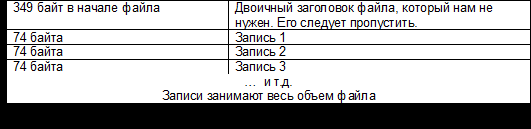
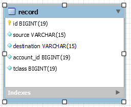
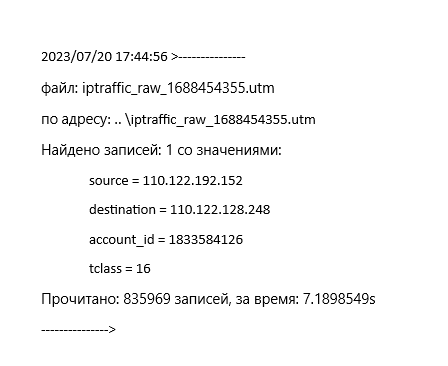
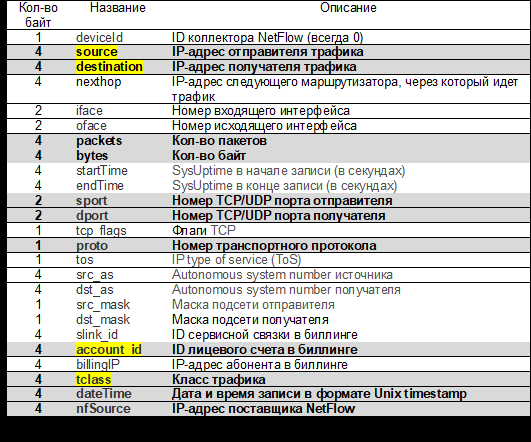

# **NetflowParser**
**NetflowParser - программа-парсер бинарных файлов, получаемых при использовании оборудования Cisco по протоколу NetFlow  
Обрабатываемые бинарные файлы предназначенных для сбора и анализа сетевого трафика, а также используемых для мониторинга   
и анализа данных о трафике, проходящем через сетевое оборудование, такое как маршрутизаторы и коммутаторы.**  
(Для записи чисел в бинарном файле используется порядок байт от младшего к старшему (little-endian),  
IP-адреса записаны в формате IPv4 (32-битное число), а все числовые значения являются целыми беззнаковыми числами).  

## Ссылка на репозиторий в Github:  
<https://github.com/EvgeniyNaumenko85/NetflowParser>

## Функционал:
- загрузка переменных среды (.env и config.yml)  
- подключение к СУБД MySQL
- автоматическое "поднятие" БД ("netflowdb") и таблицы ("record") в случае их отсутствия в СУБД MySQL  
- использование флагов: account_id, tclass, source и destination (одного или нескольких) вводимых пользователем,  
по значению которых происходит отбор необходимых записей из тела файла  
- проверка валидности вводимых флагов  
- пропуск двоичного заголовка в начале файла  
  

- последующее добавление отобранных записей в СУБД MySQL, структура записи:  
  

- ведется хронометраж обработки файла  
- результат работы программы сохраняется в создаваемый/существующий файл logfile.txt в формате:  
   

- также результат работы программы выводится в консоль  

## Формат бинарного Netflow файла:  
-   


## Стек технологий:
- Go  
- MySQL  
- логирование  
- многопоточная обработка Netflow файла  
- Graceful shutdown  
- транзакции  
- внутренняя защита от несанкционированного использования  


## База данных:
- база данных - СУБД MySQL  


## Запуск приложения:
1. приложение консольное и предлагается как собранный бинарный файл  
   (по умолчанию собран: GOOS=windows, GOARCH=amd64, *.exe)  
2. Для настройки конфигурации подключения к СУБД MySQL необходимы файлы:  
.env - здесь хранится пароль подключения к БД в виде:  
   >DB_PASSWORD=qwerty
   >  
  и файл config.yml (в папке "configs") - в ней хранятся настройки для подключения к БД в виде:   
 ```
dbMySQL:  
   driver:     "mysql"  
   user:       "user"  
   dbName:     "netflowdb"  
   protocol:   "tcp"  
   host:       "localhost"  
   port:       "3306"  
   param:  
 ```
3. Общая структура директории с исполняемым файлом:  
```
   C:.
   │   .env
   │   logfile.txt
   │   main.exe
   │   READMe.pdf
   │ 
   └───configs
         config.yml
```

## Прочая информация:
- работа программы рассчитана на стандартное количество подключений к СУБД MySQL (151 шт.)